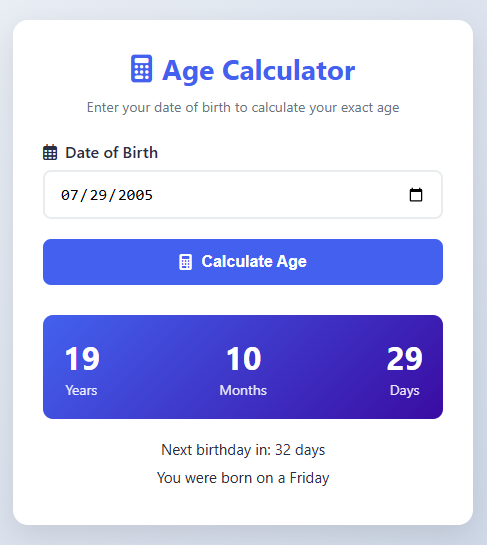

# Age Calculator ✨

**By Ayesha-Emaan**  
*CodeAlpha Web Development Internship Task*

A clean, responsive age calculator that shows your exact age in years, months, and days - built with HTML, CSS, and JavaScript.

## Features 🌟
- 📅 Simple date picker interface
- 🧮 Accurate age calculation (years/months/days)
- 📱 Mobile-friendly design
- ❌ Error handling for invalid dates
- 🎂 Bonus: Displays next birthday countdown

## Technologies Used 💻
- **Frontend**: HTML5, CSS3, JavaScript
- **Key Concepts**:
  - DOM Manipulation
  - JavaScript Date Object
  - Input Validation

## How to Use 🚀
1. Enter your birth date
2. Click "Calculate Age"
3. View your exact age breakdown

## Live Demo 🔗
[View Project Live](https://ayesha-emaan.github.io/CodeAlpha_AgeCalculator/)

## Connect With Me 👋

---

*Submitted as Task 1 for CodeAlpha Web Development Internship*  
[CodeAlpha Website](https://www.codealpha.tech)
